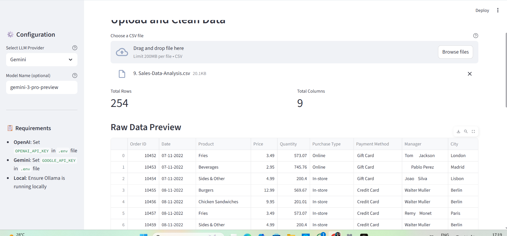
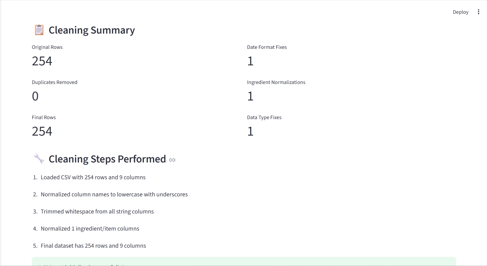
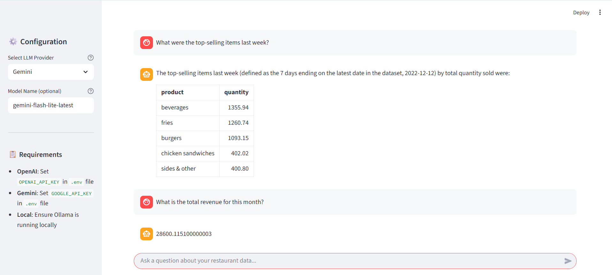
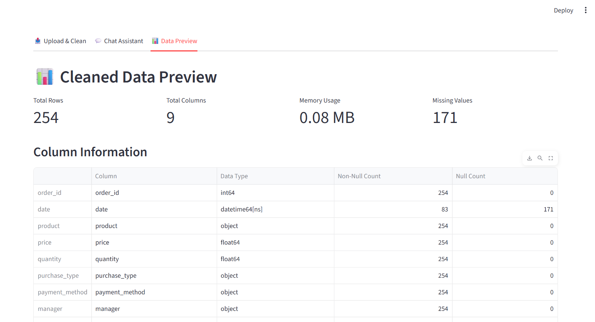

# 🍽️ Restaurant AI Assistant

A complete Python application for analyzing restaurant sales data using LangChain and Streamlit. This AI-powered assistant helps restaurant owners and managers gain insights from their sales data through natural language queries.

## 📸 Screenshots

### Upload and Clean Data

*Upload your CSV file and preview the raw data before cleaning*

### Cleaning Summary

*View detailed cleaning statistics and steps performed on your data*

### Chat Assistant

*Ask natural language questions about your restaurant sales data*

### Data Preview

*Explore cleaned data with column information and statistics*

## 📋 Features

- **Data Cleaning Module**: Automatically cleans uploaded CSV files by removing duplicates, handling missing values, fixing data types, standardizing dates, and normalizing ingredient fields
- **LangChain Agent**: Intelligent AI agent that can answer complex questions about your sales data using pandas operations
- **Multi-LLM Support**: Choose between OpenAI, Google Gemini, or local LLM (Ollama)
- **Interactive Chat Interface**: Simple Streamlit web app with chat functionality
- **Data Preview**: View cleaned dataset with statistics and column information
- **Jupyter Notebook**: Interactive notebook for experimentation and analysis

## 🚀 Quick Start

### Prerequisites

- Python 3.8 or higher
- pip package manager

### Installation

1. **Clone or download this repository**

2. **Install dependencies**:
   ```bash
   pip install -r requirements.txt
   ```

3. **Set up environment variables**:
   
   Create a `.env` file in the project root directory:
   ```env
   # For OpenAI
   OPENAI_API_KEY=your_openai_api_key_here
   
   # For Gemini
   GOOGLE_API_KEY=your_google_api_key_here
   ```
   
   **Note**: You only need to set the API key for the LLM provider you plan to use. For local LLM, ensure Ollama is installed and running.

4. **Run the application**:
   ```bash
   streamlit run main.py
   ```

5. **Open your browser**:
   The app will automatically open at `http://localhost:8501`

## 📖 How to Use

### Step 1: Upload Your CSV File

1. Navigate to the **"Upload & Clean"** tab
2. Click "Choose a CSV file" and select your restaurant sales data
3. Review the raw data preview

### Step 2: Clean Your Data

1. Click the **"🧹 Clean Data"** button
2. The system will automatically:
   - Remove duplicate rows
   - Handle missing values (fill with median/mode)
   - Fix incorrect data types
   - Standardize date formats
   - Normalize ingredient/item fields
   - Trim whitespace
3. Review the cleaning summary to see what was done
4. The cleaned data is saved as `cleaned_sales.csv`

### Step 3: Chat with AI Assistant

1. Go to the **"💬 Chat Assistant"** tab
2. Select your preferred LLM provider in the sidebar (OpenAI, Gemini, or Local)
3. Ask questions about your data in natural language

### Step 4: Preview Your Data

1. Visit the **"📊 Data Preview"** tab
2. View statistics, column information, and data preview
3. Download the cleaned CSV if needed

## 💬 Example Questions

Once your data is loaded, you can ask questions like:

- **Sales Analysis**:
  - "What were the top-selling items last week?"
  - "Show me the total revenue by day"
  - "Which day of the week has the highest sales?"
  - "What caused the drop in sales on Tuesday?"

- **Inventory Management**:
  - "How much ingredients should I order next week?"
  - "Which items are running low in stock?"
  - "What are the most used ingredients?"

- **Financial Insights**:
  - "What is the total revenue for this month?"
  - "Which items have the highest profit margin?"
  - "Show me the average order value"

- **Trend Analysis**:
  - "What are the sales trends over the past month?"
  - "Compare sales between weekdays and weekends"
  - "Which items are trending up or down?"

## 🔧 How It Works Internally

The Restaurant AI Assistant follows a streamlined pipeline:

1. **Data Ingestion**: The system loads your CSV file into a pandas DataFrame, preserving all original data structure and types.

2. **Data Cleaning**: A comprehensive cleaning module processes the data through multiple stages: removing duplicates, handling missing values intelligently (using median for numeric and mode for categorical), converting data types automatically, standardizing date formats, and normalizing text fields (especially ingredients/items).

3. **Agent Initialization**: The cleaned DataFrame is passed to a LangChain Pandas DataFrame Agent, which is configured with your chosen LLM (OpenAI, Gemini, or local). The agent can safely execute pandas operations to analyze the data.

4. **Chat Responses**: When you ask a question, the agent interprets your natural language query, generates appropriate pandas code to answer it, executes the code safely, and returns a human-readable response with insights from your data.

## 📁 Project Structure

```
Resturant-application/
│
├── main.py                          # Main Streamlit application
├── restaurant_ai_assistant.ipynb     # Jupyter notebook for experimentation
├── requirements.txt                 # Python dependencies
├── README.md                        # This file
├── .env                             # Environment variables (create this)
├── .env.example                     # Example environment variables file
├── .gitignore                       # Git ignore file
├── screenshots/                     # Screenshot images (create this folder)
│   ├── upload_clean.png
│   ├── cleaning_summary.png
│   ├── chat_assistant.png
│   └── data_preview.png
└── cleaned_sales.csv                # Output file (generated after cleaning)
```

## 🛠️ Configuration

### LLM Provider Selection

The application supports three LLM providers:

1. **OpenAI**: 
   - Requires `OPENAI_API_KEY` in `.env`
   - Default model: `gpt-3.5-turbo`
   - Can specify custom model (e.g., `gpt-4`)

2. **Gemini**:
   - Requires `GOOGLE_API_KEY` in `.env`
   - Default model: `gemini-pro`
   - Can specify custom model (e.g., `gemini-1.5-pro`)

3. **Local (Ollama)**:
   - Requires Ollama installed and running locally
   - Default model: `llama2`
   - Can specify custom model (e.g., `mistral`, `codellama`)

### Data Cleaning Configuration

The cleaning module automatically detects and handles:
- **Date columns**: Columns with "date" or "time" in the name
- **Numeric columns**: Columns with "price", "cost", "amount", "quantity", "total", "revenue", or "sales" in the name
- **Ingredient columns**: Columns with "ingredient", "item", or "product" in the name

## 📓 Jupyter Notebook

The project includes a Jupyter notebook (`restaurant_ai_assistant.ipynb`) for interactive experimentation:

```bash
jupyter notebook restaurant_ai_assistant.ipynb
```

The notebook includes:
- Step-by-step data cleaning demonstrations
- Agent setup and configuration
- Example queries and responses
- Data exploration examples

## 🐛 Troubleshooting

### Common Issues

1. **"API Key not found" error**:
   - Ensure your `.env` file exists in the project root
   - Check that the API key variable name matches exactly (e.g., `OPENAI_API_KEY`)
   - Restart the Streamlit app after adding/changing API keys

2. **"Error creating agent"**:
   - Verify your API key is valid and has sufficient credits
   - For local LLM, ensure Ollama is running: `ollama serve`

3. **"Missing optional dependency 'tabulate'"**:
   - Install the missing package: `pip install tabulate`

4. **CSV loading errors**:
   - Ensure your CSV file is properly formatted
   - Check that the file encoding is UTF-8
   - Verify the file is not corrupted

5. **Memory issues with large datasets**:
   - Consider sampling your data before uploading
   - Use the data preview tab to check memory usage

6. **PyArrow serialization errors**:
   - The application includes automatic Arrow compatibility conversion
   - If issues persist, check for mixed data types in your CSV

## 🔒 Security Notes

- The LangChain agent is configured with `allow_dangerous_code=True` to enable pandas operations. This is required for the agent to function but means the agent can execute Python code.
- API keys are stored in `.env` file (never commit this to version control)
- All pandas operations are executed in a controlled environment with access only to the provided DataFrame
- The agent only has access to your uploaded data, not your system files

## 📦 Dependencies

- `pandas>=2.0.0` - Data manipulation and analysis
- `langchain>=0.1.0` - LLM framework
- `langchain-openai>=0.0.5` - OpenAI integration
- `langchain-google-genai>=0.0.3` - Google Gemini integration
- `langchain-community>=0.0.20` - Community integrations
- `langchain-experimental>=0.0.50` - Experimental features (pandas agent)
- `streamlit>=1.28.0` - Web application framework
- `openai>=1.0.0` - OpenAI API client
- `python-dotenv>=1.0.0` - Environment variable management
- `ollama>=0.1.0` - Local LLM support
- `tabulate>=0.9.0` - Table formatting

## 📷 Adding Screenshots

To add screenshots to this README:

1. Create a `screenshots` folder in the project root
2. Save your screenshots with these names:
   - `upload_clean.png` - Upload and Clean Data interface
   - `cleaning_summary.png` - Cleaning Summary page
   - `chat_assistant.png` - Chat Assistant interface
   - `data_preview.png` - Data Preview tab

3. The images will automatically display in the Screenshots section above

## 🚀 Future Improvements

Potential enhancements for future versions:

- [ ] Support for multiple CSV files and data merging
- [ ] Advanced visualization generation (charts, graphs)
- [ ] Export reports as PDF or Excel
- [ ] Scheduled data cleaning and analysis
- [ ] Integration with restaurant POS systems
- [ ] Predictive analytics for sales forecasting
- [ ] Custom cleaning rules configuration
- [ ] Data validation rules
- [ ] Support for more data formats (Excel, JSON, etc.)
- [ ] Multi-language support for the chat interface
- [ ] Batch processing for multiple questions
- [ ] Conversation history export


